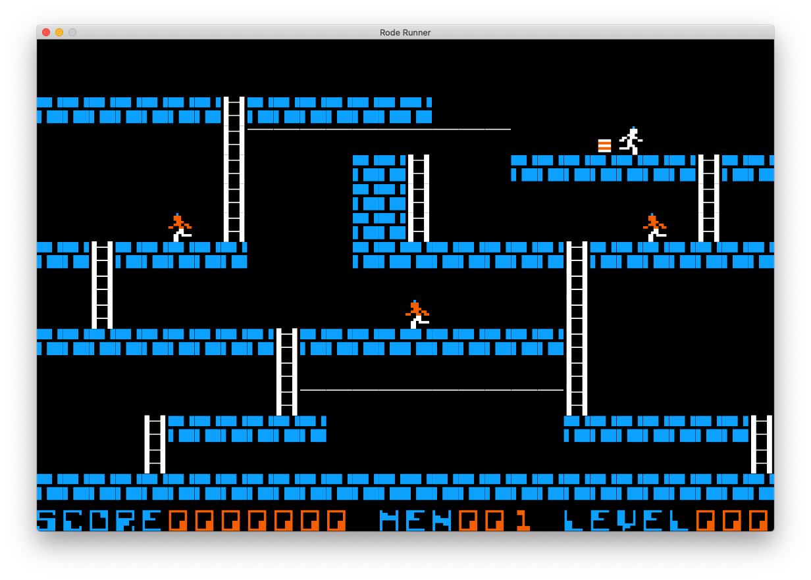

# RodeRunner
Rode Runner - python cocos2d practice

# Screen Capture

# Original from
[LodeRunner_TotalRecall](https://github.com/SimonHung/LodeRunner_TotalRecall)

# Version History
目前有點像是 Rode Runner，只是敵人還不會動，不能挖洞等，當然 Bug 還很多

## V0.1-2020/2/2
* 帶起遊戲框架，保持開源習慣，有多少更新多少
* 根據設定繪製底圖
* 有選單，可 new game, quit game
* 上下左右可控制玩家，玩家有一點動畫
* 走到最上面，會離開遊戲

## V0.2-2021/2/7
* 有點 Rode Runner 的概念
* 格子化-停下來的地方是在格子內
* 修卡在邊角的 bug
* 位置附近狀態的感知
* 支援地心引力模式
* 背景角色隱藏支援
* 第0關 debug 關支援
* 敵人，金幣精靈化
* 基本碰撞管理
* 能吃金幣
* 轉換關卡支援
* 支援跳關啟動

## V0.3-2021/2/9
* 玩家再生
* 支援分數
* HUD

# Document
https://docs.google.com/document/d/1exzg6Y1ye_YpKpwTAF8-p9lxlHZeEqcXFlwjJc2XaCA/edit?usp=sharing
